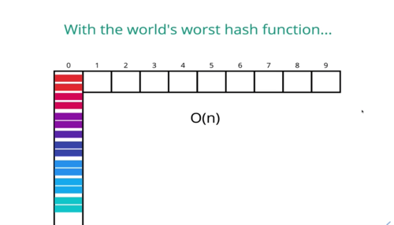

## Notes

- Avoid collisions by using prime number in the length of the table

## Handling collisions

1. separate chaining

- store pieces of data at the same spot using another nested data structure, which allows storing multiple key value pairs at the same position

1. linear probing

- Store one piece of data at each position and if there is a spot that is already taken, with search through the array to find the next empty slot
- allows us to store a single key-value at each index

 

## Methods of the HashTable Class

Using Separate Chaining

### Set

- accepts a key and a value
- hashes the key
- stores the key-value pair in the hash table array via separate chaining
  - stored in a nested structure

### Get

- accepts a key
- hashes the key
- retrieves the key-value pair in the hash table
- if value is not in the table, then return that it does not exist

### Keys

- loops through the hash table array and returns an array of keys in the table

### Values

Note: We will want to handle whether there are duplicates and how we want to return them

- loops through the hash table array and returns an array of values in the table

 

## Big O of Hash Tables (average case)

- insert: o(1)
- deletion:O(1)
- access: O(1)

### Good Hash

### Bad Hash

 

## TODO:

- add a contains method
- add tests
- implement with a linked list
