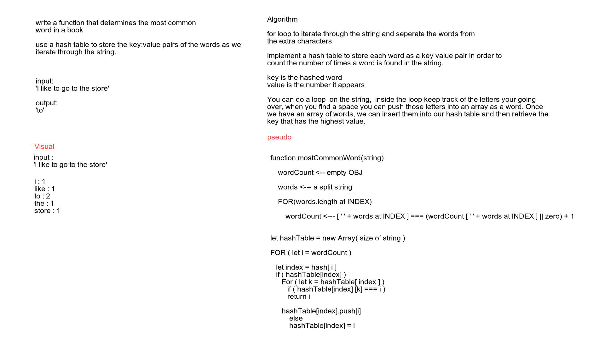

# Left Join

Code Challenge 34 [Pull request](https://github.com/Chris-Bortel/data-structures-and-algorithms/pull/59)

## Challenge

### Feature Tasks

- Ask the candidate to write a function that determines the most common word in a book.
- The most efficient solution to this problem is to use a Hastable.
- Spaces don’t count, and words are not case sensitive (i.e. Cat, CAT, and cat are all the same)
- Don’t concern yourself wth punctuation.
- The function created should take in a string as an argument.
- The best approach to this is to iterate through the string and to keep a “tally” of how many times a word appears.
the word should be the “key”, and a counter as the “value”
- The word with the highest counter at the end is the returned word.
- It is possible for the candidate to havea “tempWord” and “tempCounter” that will hold the highest word and count so far. This will prevent them from having to iterate thorugh the hashtable once the string is completed.
- Time and Space is O(n).

- Edge Cases
   -It is possible to have words show up the same amount of times as others, In this case, return the first occurrence (i.e. both “dog” and “cat” show up twice -> return “dog”);

## UML
