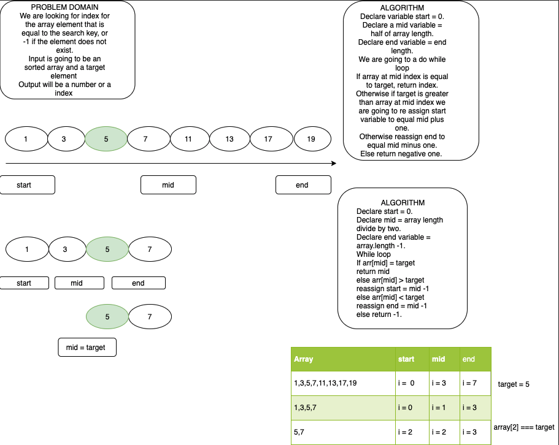

# array-binary-short summary
Use a binary search to find the index
<!-- Short summary or background information -->
## Challenge
Given an array and target find the index of the target
<!-- Description of the challenge -->
## Approach & Efficiency
<!-- What approach did you take? Why? What is the Big O space/time for this approach? -->
declared 3 variable: start mid and end. We looked at the entire array.  with a while loop, we compared the target to the middle of the array. If the target was greater than the mid then we only looked at the greater half of the array on the next iteration. Every interation, we split the array in half and searched for the target number
## Solution
<!-- Embedded whiteboard image -->
