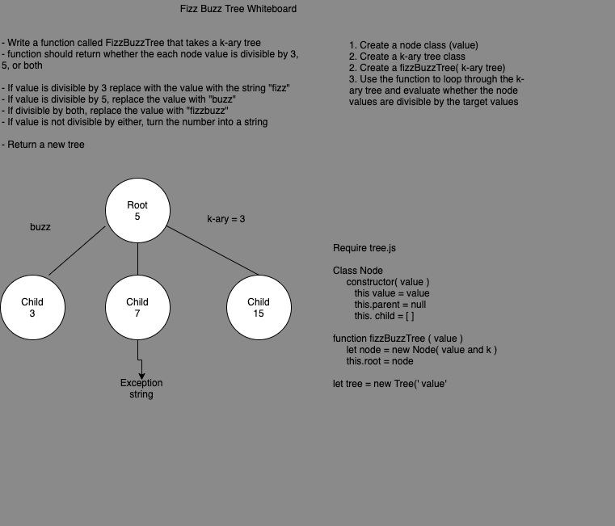

- Code Challenge 18 Fizz Buzz Tree: [Pull request](https://github.com/Chris-Bortel/data-structures-and-algorithms/pull/52)

# Implementation: K-ary Fizz Buzz

<!-- Short summary or background information -->

## Challenge

Write a function called FizzBuzzTree which takes a k-ary tree as an argument.

- Without utilizing any of the built-in methods available to your language, determine whether or not the value of each node is divisible by 3, 5 or both. Create a new tree with the same structure as the original, but the values modified as follows:

- If the value is divisible by 3, replace the value with “Fizz”

- If the value is divisible by 5, replace the value with “Buzz”

- If the value is divisible by 3 and 5, replace the value with “FizzBuzz”

- If the value is not divisible by 3 or 5, simply turn the number into a String.

- Return a new tree.

<!-- Description of the challenge -->

## Approach & Efficiency

- I am requiring in my tree class, and then making it into a k-ary

<!-- What approach did you take? Why? What is the Big O space/time for this approach? -->

## Solution

<!-- Embedded whiteboard image -->

### Fizz Buzz Tree CC 18

## Notes

## Collaboration

Worked through the UML with Brendon Hampton and Edgar Romero
