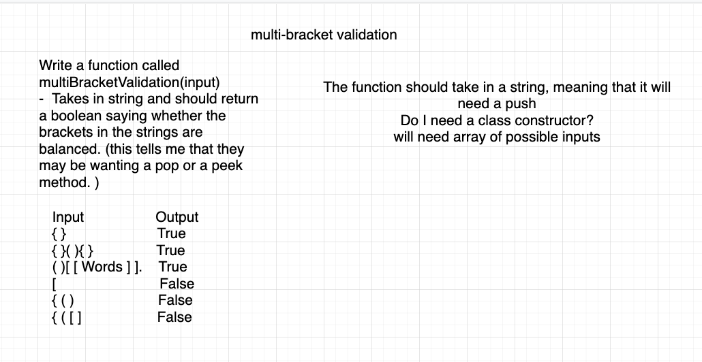

- Code Challenge 13 [Pull request](https://github.com/Chris-Bortel/data-structures-and-algorithms/pull/45)

## Challenge

<!-- Description of the challenge -->

Write a function function called multiBracketValidation() that takes a string as its only argument, and should return a boolean representing whether or not the brackets in the string are balanced(each opening bracket has a corresponding closing bracket).

- Bracket types are: () [] {}

## Approach & Efficiency

Iterate over the string.
If the current element is an opening bracket, add it to a stack.
If the current element is a closing bracket, pop off the stack and see if the brackets correspond to each other.
If at any point, the brackets don't match return false.
At the end, return whether the stack is empty.

Big O for time is O(n)
Big O for space is O(n)
<!-- What approach did you take? Why? What is the Big O space/time for this approach? -->

## Solution

<!-- Description of each method publicly available to your Linked List -->
