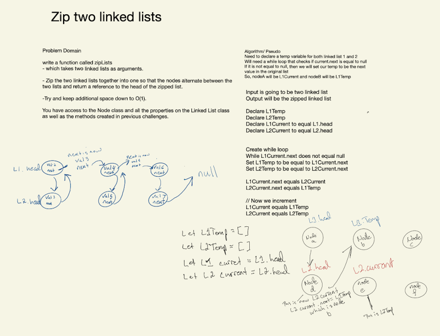

- Code Challenge 10 [Pull request](https://github.com/Chris-Bortel/data-structures-and-algorithms/pull/39)

## Challenge

<!-- Description of the challenge -->

<!-- Write a function that takes in two linked lists as arguments. Zip the two lists together so that the order in ll-1 node1, ll-2 node1, ll-1 node2, ll-2 node2, etc. Print one linked list. -->

## Approach & Efficiency

<!-- What approach did you take? Why? What is the Big O space/time for this approach? -->

## Collaborated

<!--
- Davee Sok
- Diane Stephani
- Joe Penncock
- Ryan Geddes

 -->

## API

<!-- Description of each method publicly available to your Linked List -->
