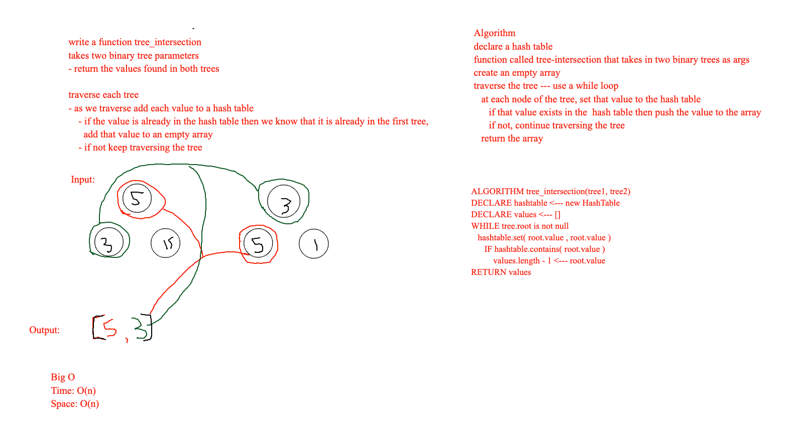

- Code Challenge 32 [Pull request](https://github.com/Chris-Bortel/data-structures-and-algorithms/pull/57)

# Tree Intersection

<!-- Short summary or background information -->

## Challenge

<!-- Description of the challenge -->

- Write a function called tree_intersection that takes two binary tree parameters.
- Without utilizing any of the built-in library methods available to your language, return a set of values found in both trees.

## Approach & Efficiency

<!-- What approach did you take? Why? What is the Big O space/time for this approach? -->

## Solution

<!-- Embedded whiteboard image -->

## Notes

- Worked in a breakout room with Ben Hill and Joe Pennock
