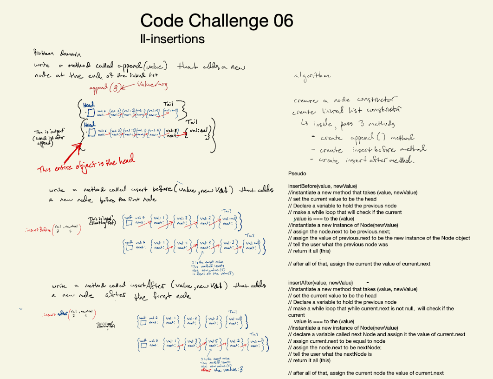

# Singly Linked List
<!-- Short summary or background information -->
[Pull request](https://github.com/Chris-Bortel/data-structures-and-algorithms/pull/36)
## Challenge
<!-- Description of the challenge -->
write three methods. Append that adds a new node to the tail node, and insertBefor that adds a new node infront of the first node, and an isertAfter() that adds a node after the first node.

## Approach & Efficiency
<!-- What approach did you take? Why? What is the Big O space/time for this approach? -->

## Collaborated
- Davee Sok
- Ben Hill
- Diane Stephani
- Brendon Hampton
- Joe Penncock

## API
<!-- Description of each method publicly available to your Linked List -->
