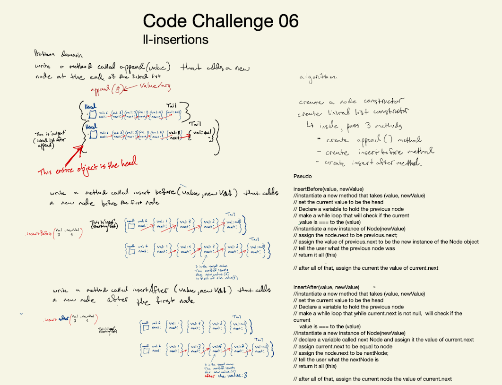

# Singly Linked List
<!-- Short summary or background information -->
- Code Challenge 05 [Pull request](https://github.com/Chris-Bortel/data-structures-and-algorithms/pull/36)
- Code Challenge 06 [Pull request](https://github.com/Chris-Bortel/data-structures-and-algorithms/pull/37)
- Code Challenge 07 [Pull request](https://github.com/Chris-Bortel/data-structures-and-algorithms/pull/38)

## Challenge
<!-- Description of the challenge -->
write three methods. Append that adds a new node to the tail node, and insertBefor that adds a new node infront of the first node, and an isertAfter() that adds a node after the first node.

## Approach & Efficiency
<!-- What approach did you take? Why? What is the Big O space/time for this approach? -->

## Collaborated
- Davee Sok
- Ben Hill
- Diane Stephani
- Brendon Hampton
- Joe Penncock

## API
<!-- Description of each method publicly available to your Linked List -->

###
 Notes:
 Array have direct access while liked lists support sequential access. Arr can jump directly to the index that it is looking for. 

 Advantage of linked list is that elements can be added and removed anywhere in memory. To add a node, you just need to create a node and then point that node to a node in the list and then connect the list to it. 
 - Delete: to delete a node, you just need to point the previous node to the next node and then break that link. 

 bad at direct access, but good at adding and removing elements because it takes the same amount of time regardless of the size of the list. THEREFORE, linked lists are a good idea for when you are working with volatile data.

 Implementation: 

 Will need a LinkedList class 
 Node class
 Methods:
  - append(value)
  - prepend()
  - deleteHead()
  - deleteTail()
  - search()
 Node class that has a contructor that takes a  (value, prev, and next)
 class Node {
   constructor(value, prev, next) {
     this.value = value
     this.prev = prev || null
     this.next = next || null
   }
 }

### Big o of includes
- the big o of includes is O(n) ... this is because at its worse case, the node that we are looking for will be ththe very last node in th5 elinked list. OHHH!! n represents the number of nodes in the list
 