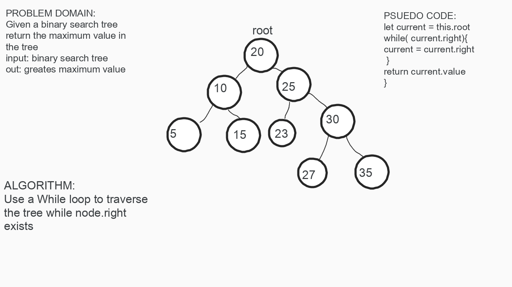

- Code Challenge 15 [Pull request](https://github.com/Chris-Bortel/data-structures-and-algorithms/pull/47)
- Code Challenge 16 Find Max Binary: [Pull request](https://github.com/Chris-Bortel/data-structures-and-algorithms/pull/49)
- Code Challenge 17 [Pull request](https://github.com/Chris-Bortel/data-structures-and-algorithms/pull/48)

# Implementation: Trees

<!-- Short summary or background information -->

## Challenge

<!-- Description of the challenge -->

- Create a Node class that has properties for the value stored in the node, the left child node, and the right child node.

- Create a BinaryTree class

  - Define a method for each of the depth first traversals called preOrder, inOrder, and postOrder which returns an array of the values, ordered appropriately.

- Any exceptions or errors that come from your code should be semantic, capture errors. For example, rather than a default error thrown by your language, your code should raise/throw a custom, semantic error that describes what went wrong in calling the methods you wrote for this lab.

- Create a BinarySearchTree class

  - Define a method named add that accepts a value, and adds a new node with that value in the correct location in the binary search tree.

  - Define a method named contains that accepts a value, and returns a boolean indicating whether or not the value is in the tree at least once.

## Approach & Efficiency

<!-- What approach did you take? Why? What is the Big O space/time for this approach? -->

## Solution

<!-- Embedded whiteboard image -->

## Notes
